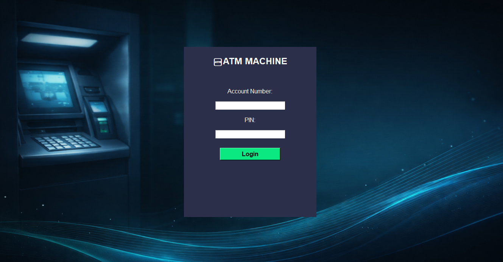
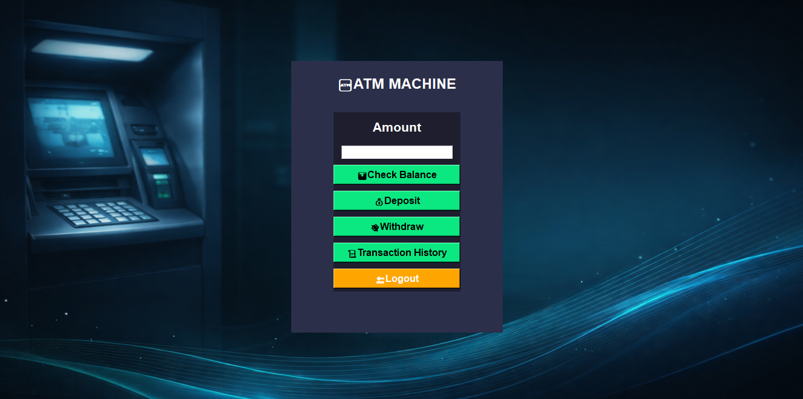
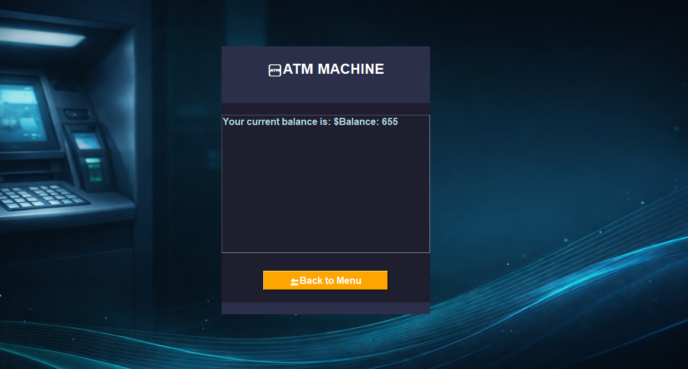
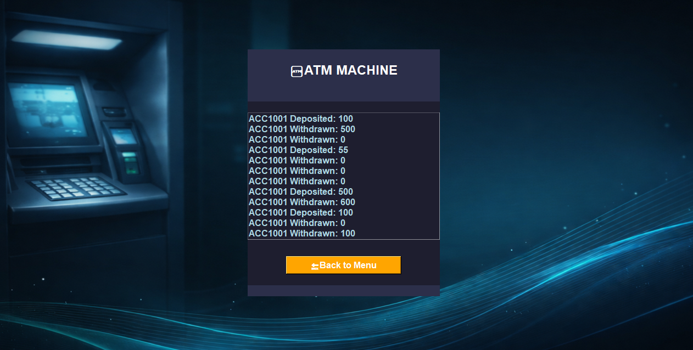

# 💳 ATM Machine Project

A simple ATM simulation project built using Python (Tkinter) and C backend.

## 🚀 Features
- 🔐 Login system (Account + PIN)
- 💰 Check Balance
- 💸 Deposit Money
- 🏧 Withdraw Money
- 📊 Transaction History
- 🔄 Smooth UI navigation

---

## 📸 Screenshots

### 🔐 Login Screen

### 💳 ATM Menu

### 💰 Balance Check

### 📊 Transaction History

---

## 🛠️ Tech Used
- Python (Tkinter)
- C (Backend Logic)
- File Handling (Database)

---

## 👨‍💻 Author
Samarth S Shet
